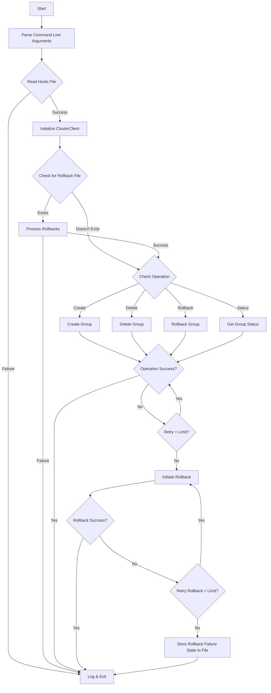

# Cluster Client Module

This module provides a client for managing groups across multiple nodes in a cluster with an unstable API.

## Assumptions

1. All nodes in the cluster have the same RESTful API.
2. The API is unstable and may experience connection timeouts or 500 errors.
3. When creating a group, it must be created on all nodes or rolled back if any node fails.
4. When deleting a group, it should be deleted from all nodes.
5. Create group fails if the group already exist in the node.
6. Delete returns 200 even if the group doesn't exist.
7. Logging is used to track operations and errors.

## How Cluster CLient works

## Usage

### Run locally

#### Build Docker Image

> docker build -t cluster-client-app .

#### Run the Docker container

> docker run -d --name cluster-client-app-container cluster-client-app

#### Run the container's shell

> docker exec -it cluster-client-app-container /bin/bash

#### Create Group

> python -m app.main create, group_name

#### Delete Group

> python -m app.main delete, group_name

#### Check Cluster Group Status

> python -m app.main status, group_name

#### Re-run failed rollbacks

> python -m app.main rollback

### Run on Kubernetes Cluster

#### Build Docker Image

> docker build -t cluster-client-app .

#### Tag the image to push to docker hub or any docker registry

> docker tag cluster-client-app:latest your-dockerhub-username/cluster-client-app:latest

#### Push the image to docker registry

> docker push your-dockerhub-username/my-python-app:latest

#### Start kubernetes deployment

> kubectl apply -f kubernetes/deployment.yaml

#### Verify the running pods

> kubectl get pods

#### Connect to the running pod through ssh

> kubectl exec -it [pod_name] -- /bin/bash

#### Create Group

> python -m app.main create, group_name

#### Delete Group

> python -m app.main delete, group_name

#### Check Cluster Group Status

> python -m app.main status, group_name

#### Re-run failed rollbacks

> python -m app.main rollback

## Run Tests

Tests are written using pytest.
To run the tests, install test-requirements.txt

> pip install -r test-requirements.txt

Then run pytest command on the root folder

> pytest
